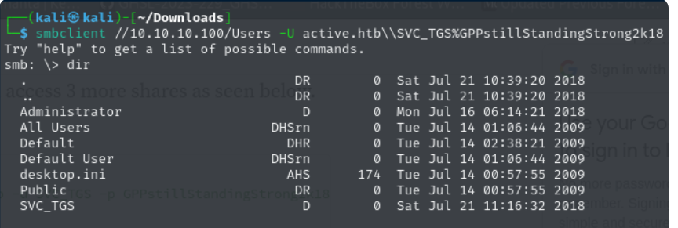
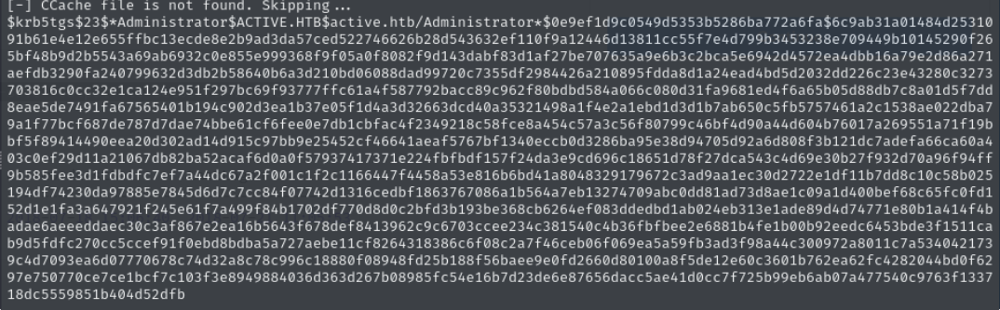
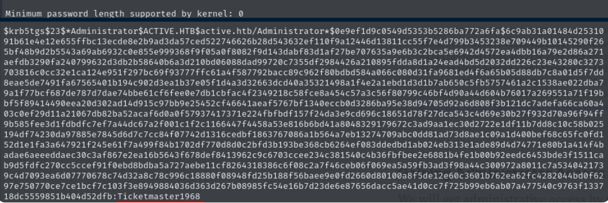
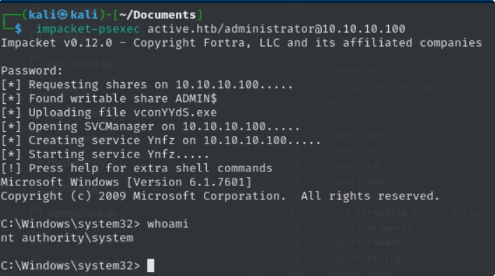

# Active Directory Attack Chain: From Low Privilege User to Domain Admin (HTB Active)

## 🎯 Objective
Compromise an Active Directory environment and escalate privileges from a low-privileged domain user to Domain Administrator.

---

## 🧭 Methodology

### 1. Initial Access
Access was obtained using valid domain credentials for a low-privileged user account.

SMB access confirmed the credentials were valid and allowed interaction with shared resources.

---

### 2. Enumeration
Domain enumeration was performed to identify potential attack vectors.

Service accounts with Service Principal Names (SPNs) were identified, indicating possible Kerberoasting opportunities.

---

### 3. Kerberoasting
Kerberos service tickets were requested for accounts with SPNs.

These tickets were extracted and prepared for offline password cracking.

---

### 4. Password Cracking
The extracted Kerberos ticket was cracked offline using a wordlist.

This revealed valid credentials for a higher-privileged account.

---

### 5. Privilege Escalation
Using the obtained credentials, remote access was achieved via SMB.

The account had sufficient privileges to execute commands remotely, resulting in SYSTEM-level access.

---

## 🛠 Tools Used
- smbclient
- Impacket (GetUserSPNs, psexec)
- Hashcat
- Manual enumeration

---

## 💡 Key Takeaways
- Kerberoasting remains highly effective against weak service account passwords
- Credential reuse significantly increases attack impact
- Active Directory compromises often involve chaining multiple techniques
- Proper monitoring and strong password policies are critical for defense

---

## ⚠️ Disclaimer
This writeup is a sanitized summary of a lab environment for educational purposes.
