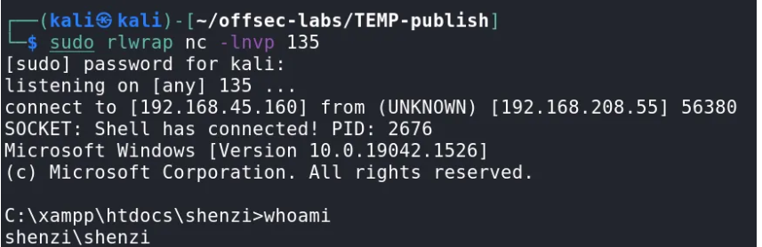
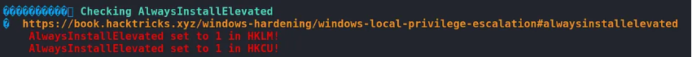
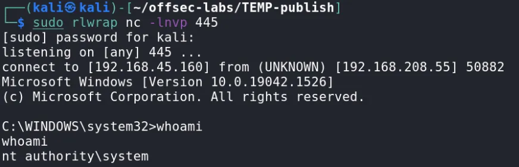

# Windows Privilege Escalation via AlwaysInstallElevated

## 🎯 Objective
Gain initial access to a Windows machine and escalate privileges to SYSTEM.

---

## 🧭 Methodology

### 1. Enumeration
Initial enumeration revealed multiple services, including SMB and a web application.

Further analysis of accessible resources led to the discovery of sensitive information that could be leveraged for authentication.

---

### 2. Initial Access
Using the discovered credentials, access to a web application was obtained.

The application allowed modification of server-side functionality, which was leveraged to achieve remote command execution.

This resulted in a reverse shell as a low-privileged user.

---

### 3. Local Enumeration
Once access was obtained, local enumeration was performed to identify privilege escalation vectors.

During this phase, a misconfiguration related to Windows Installer policies was identified.

Specifically:
- `AlwaysInstallElevated` was enabled in both HKLM and HKCU

---

### 4. Privilege Escalation
The AlwaysInstallElevated configuration allows MSI packages to be executed with elevated privileges.

This misconfiguration was exploited to execute a malicious installer, resulting in a SYSTEM-level shell.

---

## 🛠 Tools Used
- Nmap
- SMB enumeration tools
- Netcat
- WinPEAS
- Manual enumeration

---

## 💡 Key Takeaways
- Misconfigured SMB shares can expose sensitive credentials
- Web application access can often be leveraged for remote code execution
- AlwaysInstallElevated is a critical misconfiguration that can lead to full system compromise
- Proper enumeration is essential for identifying escalation paths

---

## ⚠️ Disclaimer
This writeup is a sanitized summary of a lab environment for educational purposes. No sensitive or restricted content is disclosed.
